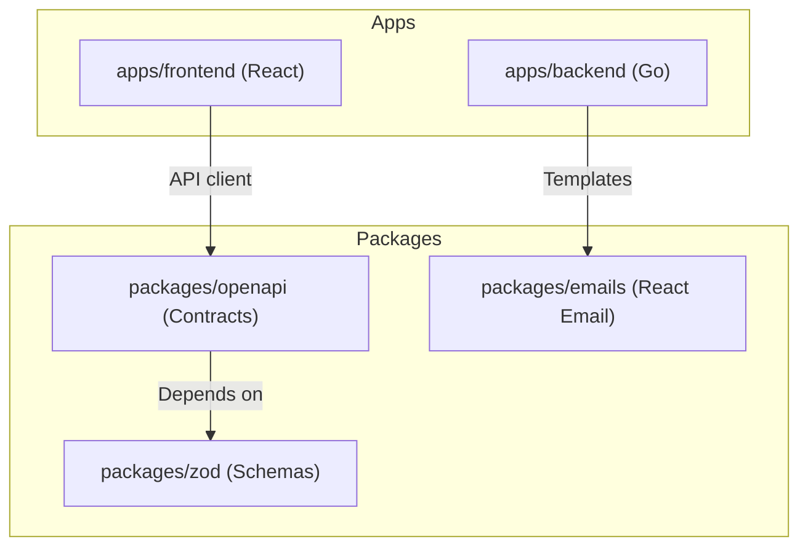

# Protask Monorepo

Welcome to **Protask**, a modern, high-performance task management boilerplate built as a monorepo. It features a robust **Go backend** (Echo) and a slick **React SPA** (Vite + Tailwind CSS v4) communicating over type-safe HTTP contracts.

---

## 🏗️ Repository Architecture

This codebase is managed with **Turborepo** and package-managed via **Bun**.



### Main Directories

| Directory | Type | Language/Framework | Purpose |
| :--- | :--- | :--- | :--- |
| [`apps/backend`](./apps/backend) | Service | Go (Echo v4) | API server, Postgres migrations, Redis task queue, Clerk auth |
| [`apps/frontend`](./apps/frontend) | Client | TS (React, Vite, Tailwind v4) | Single Page Application dashboard & todo manager |
| [`packages/emails`](./packages/emails) | Package | TypeScript (React Email) | Shared transactional email builder & preview tool |
| [`packages/openapi`](./packages/openapi) | Package | TypeScript (ts-rest) | OpenAPI contract builder linking frontend & backend schemas |
| [`packages/zod`](./packages/zod) | Package | TypeScript (Zod) | Shared request/response validation schemas |

---

## 🛠️ Prerequisites

Before you start, ensure you have the following installed on your machine:

* **Bun**: Version `^1.2.13` (Package manager & task execution)
* **Go**: Version `1.24+` (For backend)
* **PostgreSQL**: Version `16+` (Backend DB)
* **Redis**: Version `8+` (Queue storage for Asynq background tasks)
* **Task**: For managing backend-specific commands ([Taskfile.dev](https://taskfile.dev))

---

## 🚀 Getting Started

### 1. Install Dependencies
Run the following at the monorepo root to install node dependencies and build the TypeScript packages:
```bash
bun install
```

### 2. Set Up Environment Variables
Both applications require environment variables:

* **Backend**:
  Copy the backend sample environment file and adjust configuration:
  ```bash
  cd apps/backend
  cp .env.sample .env
  ```
* **Frontend**:
  Configure the local environment for Vite (e.g. Clerk public key):
  ```bash
  cd apps/frontend
  cp .env.local.sample .env.local # Or create one if sample doesn't exist
  ```

### 3. Initialize the Database
Ensure PostgreSQL is running, then run backend migrations using Go Task:
```bash
cd apps/backend
task migrations:up
```

### 4. Run Development Servers
To run frontend, backend, and all dependent packages simultaneously in development mode, run the following in the root folder:
```bash
bun dev
```
This runs the Turborepo dev runner, starting both the backend service and the frontend Vite server.

---

## ⚙️ Monorepo Scripts

The following commands are available from the root of the repository:

* **`bun dev`**: Runs all applications and package builders in watch mode.
* **`bun build`**: Compiles all packages and builds frontend assets for production.
* **`bun lint`**: Lints frontend and packages.
* **`bun lint:fix`**: Runs ESLint with autorigging across frontend & packages.
* **`bun format:check`**: Checks formatting rules using Prettier.
* **`bun format:fix`**: Automatically formats all Javascript/Typescript files using Prettier.
* **`bun typecheck`**: Runs TypeScript compiler checks on the frontend and packages.
* **`bun clean`**: Clears `.turbo` caches, compiler build outputs, and `node_modules` folders.

---

## 🔒 Third-Party Integrations

* **Authentication**: [Clerk](https://clerk.com) is used for secure user sessions.
* **APM & Logging**: [New Relic](https://newrelic.com) is integrated in the Go backend along with [Zerolog](https://github.com/rs/zerolog) for JSON structured output.
* **Transactional Email**: [Resend](https://resend.com) handles email dispatching.

---

For detailed instructions, refer to the respective project READMEs:
* Read the [Backend README](./apps/backend/README.md) for database structure and backend architecture.
* Read the [Frontend README](./apps/frontend/README.md) for UI components and style guidelines.
